<a href="https://github.com/QiuChenlyOpenSource">

</a>


<p align="center">🔞全球各❤️地❤️服❤️务🔞<br/>
🔞①线至①⑧线城市齐全🔞<br/>
🔞汇❤️编 🚗与🤤ASM约❤️会🔞<br/>
🔞 一❤️个❤️人独自在家❤️火❤️热❤️难❤️耐 玩🔞逆🔞向 🔞<br/>
🔞找Qiu❤️Chen❤️l❤️y❤️Open❤️Source🔞<br/></p>

<!-- TOC -->
* [加入小团体](#加入小团体)
      * [這就是原神的力量!點擊圖片進入新世界](#這就是原神的力量點擊圖片進入新世界)
* [警告](#警告)
* [使用](#使用)
* [【用前必读】重要提示](#用前必读重要提示)
* [【用前必读】可能会遇到的问题](#用前必读可能会遇到的问题)
* [操作系统要求 & 代码编译环境要求](#操作系统要求--代码编译环境要求)
* [App支持一览表](#app支持一览表)
* [特别说明](#特别说明)
  * [Surge 激活必读](#surge-激活必读)
    * [Surge Mac 助手程序（Helper）异常处理方式](#surge-mac-助手程序helper异常处理方式)
  * [Adobe 全家桶激活必读](#adobe-全家桶激活必读)
  * [Emby Server 激活必读](#emby-server-激活必读)
  * [Sublime 激活必读](#sublime-激活必读)
  * [PD 19 激活必读](#pd-19-激活必读)
  * [Typora 激活必读](#typora-激活必读)
* [Surge-crack-模块支持激活的-macOS-App](#Surge-crack-模块支持激活的-macOS-App)
* [目的](#目的)
* [骂人小作文](#骂人小作文)
* [~~免责声明~~wo ze ni ma de b](#免责声明wo-ze-ni-ma-de-b)
* [~~停更~~](#停更)
<!-- TOC -->

# 加入小团体

关注我的频道，进群获取最新的推送资讯。

学习班小团体不收人了。目前有一两个同学在学习就够了, 主要是很多朋友觉得收钱这种行为不好,让有些朋友产生了有钱就能为所欲为的错觉 在进行了深度的自我批判后我决定停止这种败坏风气的行为。所以想付费学习的另寻他处,简而言之:滚。

老有人问我什么时候开源，你猜我为什么不愿意发出来而是团队内部开源？有没有可能是确实开源，但仅限对部分人开？就看我其他几个opensource项目就知道了，0
pr，全都是download&git pull. 没有人愿意提PR，一个都没有。声称有愿意提的70%是骗子，就想要代码就直说。拿了代码人就消失了，你们觉得谁是Joker？

目前只接受部分愿意提交pr与交流学习提升的同学加入InjectLib。

```
要求:
1. 有部分逆向基础与理解。
2. 可以独立“学习”一些app。
3. 处于瓶劲期，想要进一步提升。
4. 不收费。你看得懂什么叫OpenSource吗？
5. 愿意与大家交流心得，而不是语焉不详的说一些看似有价值实则毫无意义的废话。要么就解释清楚，要么就滚出去。冒个头说两句似是而非的话装什么大佬？
6. 禁止牟利：包括但不仅限于索要打赏与捐赠。说实话就你那点b水平有你吗脸要捐赠啊？
7. 不准骂人(除非有人确实傻逼 那我就不得不开口了)。
8. 如果你只想自己学习而不想与大家分享学习心得，请你趁早滚。别等事发后受到我的精神洗礼。
9. 我回答问题也是分人的，你要是志同道合我自然言无不尽，但你若是自私小人那你就别指望我能好好回答。
10. 贡献代码者均会在InjectLib项目主页增加Credit。
```

關注我的Telegram頻道和群組,分享最新資訊和技術。
<br>
頻道: **<https://t.me/qiuchenlymac>**

别让欲望击穿你の意志
<br>
群組: **<https://t.me/+f3BWmkjVCzQwYzM1>**
<br>
關注我的Twitter:
https://twitter.com/QiuChenly
<br>
關注QiuChenly喵，關注落葉的Twitter喵。謝謝大家喵。

點點關注不迷路！

#### 這就是原神的力量!點擊圖片進入新世界

[](https://ipfs.lanyundev.com/ipfs/bafybeigpm6ocaba2wlgi7zgio3lu7hzqxgrviiicuwc5xbddlo77leabcy/6e51fccaeb5343bda366d42e68c3c705.MP4)

# 警告

上方表格中App的SIP状态为"✅"则可以不用关闭SIP即可使用,并且注入下载文件夹不需要保留，注入后可以删除。
本库中几乎所有的App都建议你在打开SIP状态下使用，不建议用户关闭SIP，除非你很懂这块。

# 使用

1. 下载整个仓库并解压，双击运行"原神_启动.command"并输入密码，按照提示操作。
   <br>
   小白不知道点哪里下载整个仓库？[点我下载](https://github.com/QiuChenlyOpenSource/91QiuChen/archive/refs/heads/main.zip)
2. 要是你不差这几分钟时间，从头到尾先认真读一遍这个readme，可能你看完之后会解决你的部分疑惑。

# 【用前必读】重要提示

<details>
<summary>点击展开</summary>

1. 本脚本会自动扫描本地安装的App，你只需要在想注入的App后面输入y即可。
2. Adobe App如果不想让官方ACC乱拉屎，可以用这个仓库下载v6版本的离线安装包: https://github.com/Drovosek01/adobe-packager,
   然后配合AntiCC之类的组件运行Adobe产品。
3. 激活之后由于App还需要依赖我的注入代码，所以不要移动注入文件夹或者删除注入文件夹，有的人用完就把注入文件夹删了，第二天就到处说破解不稳定第二次就崩溃。
   这种人你动动你那个🐷脑子想想为什么第一次能用删了我的注入文件夹第二次打开就崩溃？
4. 脚本如果没有权限执行注入操作终端报错类似于下面这样:<br>
   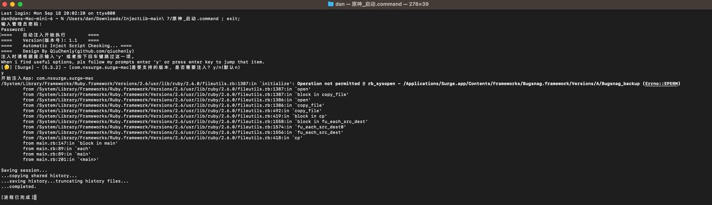
   那是因为SIP的安全策略限制不允许运行不符合安全策略的代码执行，所以你需要先打开:<br>
   设置 - 隐私与安全性 - 开发者工具:<br>
   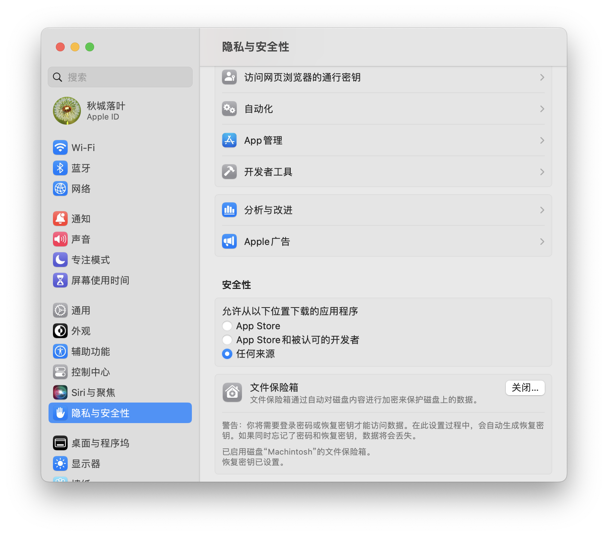<br>
   并打开终端执行代码策略:<br>
   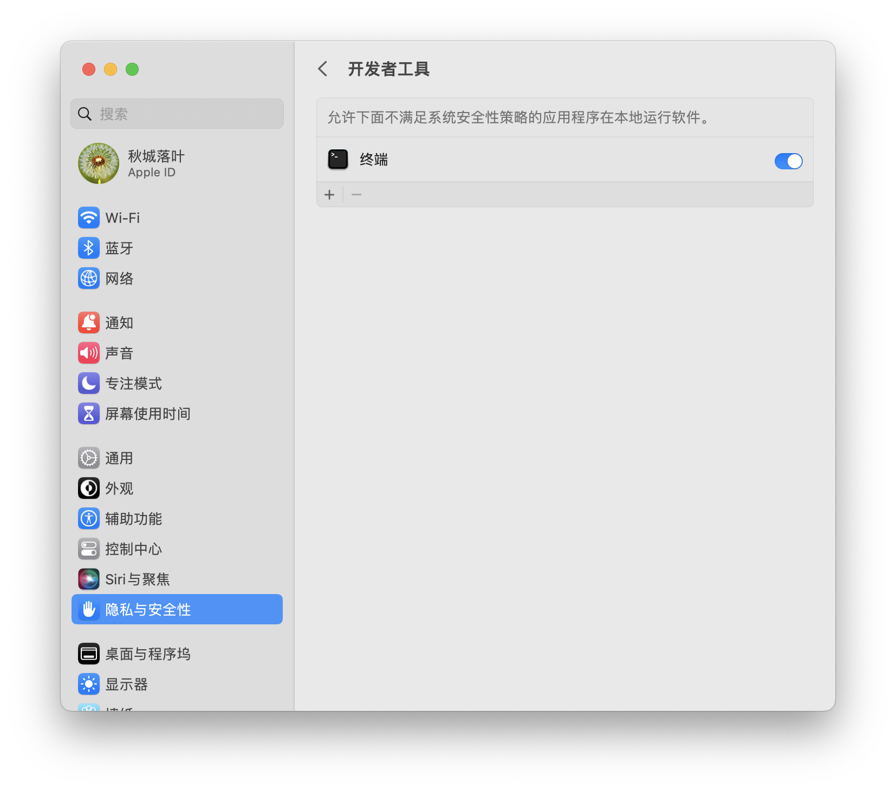<br>

   最后重新执行即可正常注入。这是MacOS的安全策略，麻烦你动动你那个b手点一下好吗？

</details>

# 【用前必读】可能会遇到的问题

<details>
<summary>点击展开</summary>

1. 遇到"xxx想要访问你的机密信息"<br>
   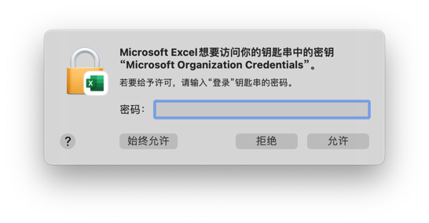<br>
   原因:<br>
   补丁对某些App会自动签名以保证能在SIP打开的情况下使用.但是保存在钥匙串里的信息只能被官方签名的app读取
   自己签名App后会造成丢失权限<br><br>
   解决方案:<br>
   輸入你的密碼，並點擊始終允許即可。<br><br>

2. 我不会用终端<br>
   解决方案:<br>
   使用我提供的"原神_启动.command"来进行注入。软件界面简单,只需要按提示操作即可完成注入工作,无需手動打開終端。<br><br>

3. 需要移到垃圾篓
   应该是App没有打开过就直接执行注入了。这可能会导致检查不通过，不过影响不是很大。建议App在注入前先运行一次。

   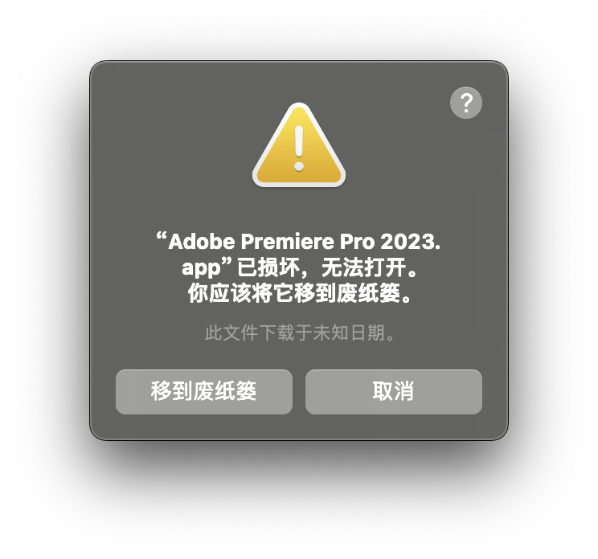

   这是正常的，因为SIP打开的情况下如果修改了App会导致校验不通过，你只需要手动从Finder中右击点开一次就好了:<br>
   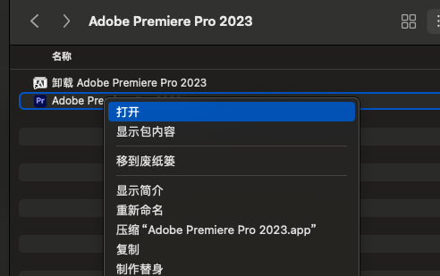
   

   此时就能正常打开。如果还出现问题，请检查自己的注入操作有没有问题。<br><br>

4. Operation not permitted<br>
   如下所示。<br>
   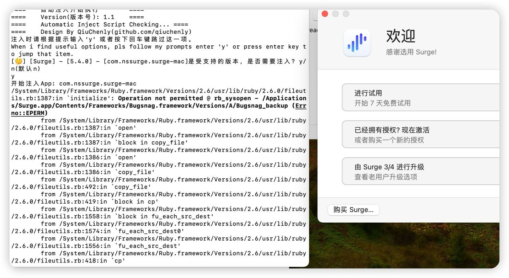<br>
   ```
   开始注入App: com.nssurge.surge-mac
   /System/Library/Frameworks/Ruby.framework/Versions/2.6/usr/lib/ruby/2.6.0/fileutils.rb:1387:in `initialize': Operation not permitted @ rb_sysopen - /Applications/Surge.app/Contents/Frameworks/Bugsnag.framework/Versions/A/Bugsnag_backup (Errno::EPERM)
   ```
   这是很多人会遇到的问题。<br>Operation not permitted就是终端app需要修改app，但是没权限 所以会崩溃。<br>
   原因：终端没有给操作权限<br>
   解决办法：<br>
    1. 打开设置<br>
    2. 隐私和安全性<br>
    3. 开发者工具 和 App管理<br>
    4. 两个地方都要打开终端开关，重启终端即可正常执行。<br>
       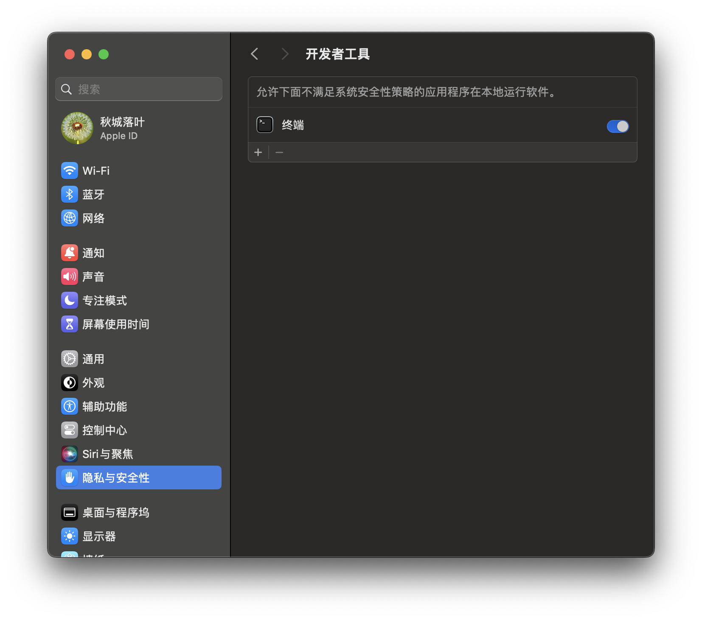<br>
       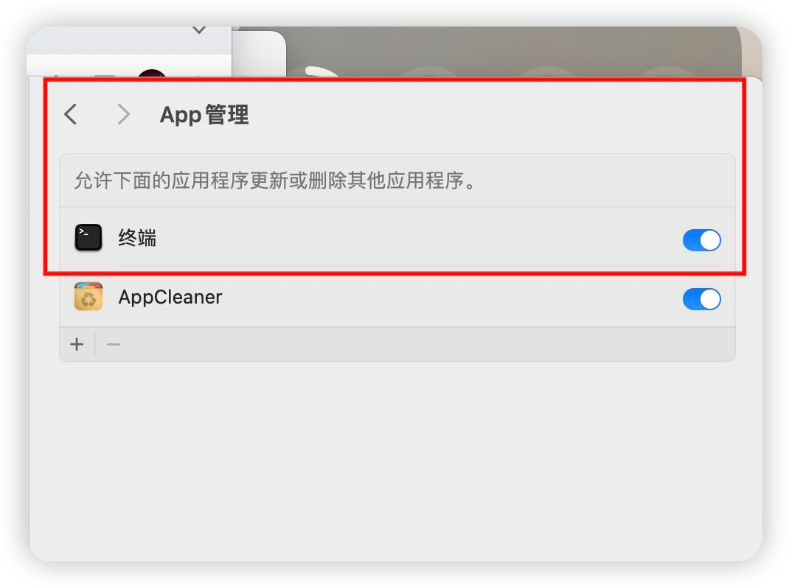

</details>

# 操作系统要求 & 代码编译环境要求

<details>
<summary>点击展开</summary>

- 最低运行 macOS High Sierra 10.13
- 编译SDK macOS 14.0
- 目标部署平台 macOS 10.13
- CMakeLists 环境变量
    - set(CMAKE_OSX_DEPLOYMENT_TARGET "10.13")
- 检查二进制文件的最低macOS版本兼容性
    - ```find . -name "*.*" | xargs otool -l | grep -E "(minos|sdk)"```

</details>

***

# App支持一览表

<details>
<summary style="font-size: 40px;font-weight: bolder">支持的 macOS App</summary>

- ARM64 & Intel: ✅ 表示可用, ❌ 表示不可用<br>
- SIP: ✅ 表示可以在打开SIP的机器上使用, ❌ 表示只能在关闭SIP使用<br>
- 维护状态解析:
    - ⚠️暂未维护 此App我不定期保持更新 不会停更 可以提Issues
    - ❌停止维护 此App确定已停止更新 Issues可以提但是基本不会理你
    - ✅正常维护 此App有Bug/新版本你可以Issues随时提

| App                                             | 版本                                                                                                                                                                      | ARM64 | Intel | SIP | 特殊要求                                                                                                                                                                            | 维护者                                       | 维护状态   |
|:------------------------------------------------|:------------------------------------------------------------------------------------------------------------------------------------------------------------------------|:-----:|:-----:|-----|:--------------------------------------------------------------------------------------------------------------------------------------------------------------------------------|-------------------------------------------|--------|
| MWEB Pro                                        | 通杀                                                                                                                                                                      |   ✅   |   ✅   | ✅   |                                                                                                                                                                                 | [QiuChenly](https://github.com/QiuChenly) | ✅正常维护中 |
| Navicat Premium                                 | 通杀                                                                                                                                                                      |   ✅   |   ✅   | ✅   | 需要从Mac AppStore 下载                                                                                                                                                              | [QiuChenly](https://github.com/QiuChenly) | ✅正常维护中 |
| Navicat 16 ForOracle                            | 通杀                                                                                                                                                                      |   ❌   |   ✅   | ✅   | 需要从Mac AppStore 下载 我下不到ARM64的版本                                                                                                                                                 | [QiuChenly](https://github.com/QiuChenly) | ✅正常维护中 |
| Sublime Text                                    | [通杀](https://download.sublimetext.com/sublime_text_build_4154_mac.zip)                                                                                                  |   ✅   |   ✅   | ✅   | 授权信息下面找。                                                                                                                                                                        | [QiuChenly](https://github.com/QiuChenly) | ✅正常维护中 |
| Elpass                                          | [通杀](https://elpass.app/macos/Elpass-1.5.6-490.zip)                                                                                                                     |   ✅   |   ✅   | ✅   | 无法使用云同步 签名后的app通病 无解 搭配Surge脚本可以做到5138年授权 https://elpass.app/macos/appcast-beta.xml                                                                                             |[QiuChenly](https://github.com/QiuChenly)|❌停止维护|
| CleanMyMac X                                    | 通杀                                                                                                                                                                      |   ✅   |   ✅   | ✅   | com.macpaw.CleanMyMac4.Menu 单独也要注入 Helper每个版本不一样还是需要单独处理 暂时不弄了 不要下大陆特供版 更新地址: https://s3-us-west-2.amazonaws.com/updateinfo.devmate.com/com.macpaw.CleanMyMac4/beta/updates.xml |[QiuChenly](https://github.com/QiuChenly)|✅正常维护中|
| Stash                                           | [2.5.4](https://mac-release-static.stash.ws/Stash-latest.zip)                                                                                                           |   ✅   |   ✅   | ✅   | 完美破解但是总体体验较差 不如surge https://mac-release.stash.ws/appcast.xml                                                                                                                   | [QiuChenly](https://github.com/QiuChenly) | ✅正常维护中 |
| Paste                                           | 4.1.2                                                                                                                                                                   |   ✅   |   ✅   | ✅   | 全新算法，杀！                                                                                                                                                                         | [QiuChenly](https://github.com/QiuChenly) | ✅正常维护中 |
| App Cleaner & Uninstaller                       | 8.2.6                                                                                                                                                                   |   ✅   |   ✅   | ✅   | [下载地址](https://download.nektony.com/pro-support/v3/app-cleaner/update/update.xml)                                                                                                                                                                        | [QiuChenly](https://github.com/QiuChenly) | ✅正常维护中 |
| MacCleaner Pro                                  | 3.2.7                                                                                                                                                                   |   ✅   |   ✅   | ✅   | [下载地址](https://download.nektony.com/pro-support/v3/mac-cleaner-pro/update/update.xml)                                                                                                                                                                        | [QiuChenly](https://github.com/QiuChenly) | ✅正常维护中 |
| Duplicate File Finder                           | 8.0.1                                                                                                                                                                   |   ✅   |   ✅   | ✅   | [下载地址](https://download.nektony.com/pro-support/v3/duplicates-finder-site/update/update.xml)                                                                                                                                                                        | [QiuChenly](https://github.com/QiuChenly) | ✅正常维护中 |
| Disk Space Analyzer                             | 4.1.9                                                                                                                                                                   |   ✅   |   ✅   | ✅   | [下载地址](https://download.nektony.com/pro-support/v3/disk-expert/update/update.xml)                                                                                                                                                                        | [QiuChenly](https://github.com/QiuChenly) | ✅正常维护中 |
| ProxyMan                                        | [通杀](https://download.proxyman.io/49100/Proxyman_4.10.0.dmg)                                                                                                            |   ✅   |   ✅   | ✅   | 更新地址: https://proxyman.io/osx/version.xml                                                                                                                                       | [QiuChenly](https://github.com/QiuChenly) | ✅正常维护中 |
| BuhoCleaner                                     | [通杀](https://www.drbuho.com/buho-public-files/buhocleaner/buhocleaner197150.dmg)                                                                                        |   ✅   |   ✅   | ✅   | 更新地址:https://www.drbuho.com/buho-public-files/buhocleaner/appcast.xml                                                                                                           | [QiuChenly](https://github.com/QiuChenly) | ✅正常维护中 |
| Macs Fan Control                                | [通杀](https://crystalidea.com/downloads/macsfancontrol.zip)                                                                                                              |   ✅   |   ✅   | ✅   |                                                                                                                                                                                 | [QiuChenly](https://github.com/QiuChenly) | ✅正常维护中 |
| TablePlus                                       | [通杀](https://tableplus.com/release/osx/tableplus_latest)                                                                                                                |   ✅   |   ✅   | ✅   | 老子第一次喷App: 傻逼App 做的跟shit一样 我伪造的授权信息在内存数据结构被篡改成不知道哪来的ObjectC对象引起崩溃 浪费老子时间 真的垃圾App 作者能不能几把优化一下？？ 就这破App 老子弄到凌晨三点 真的狗都不用 而且连个汉化都没有 格局Down Down了                                    | [QiuChenly](https://github.com/QiuChenly) | ✅正常维护中 |
| Transmit 5                                      | 5.9.2                                                                                                                                                                   |   ✅   |   ✅   | ✅   | 需要从App Store下载                                                                                                                                                                  | [QiuChenly](https://github.com/QiuChenly) | ✅正常维护中 |
| DevUtils                                        | [1.17.0](https://devutils.com/archives/DevUtils-1.17.0.dmg)                                                                                                             |   ✅   |   ✅   | ✅   | 功能可用 但是激活状态我懒得改了 作者写的这个App代码质量之烂令人无语 不想多说什么了                                                                                                                                    | [QiuChenly](https://github.com/QiuChenly) | ✅正常维护中 |
| MP3Tag                                          | [1.8.6 (86)](https://updates.mp3tag.app/Mp3tag-1.8.6.zip)                                                                                                               |   ❌   |   ✅   | ✅   | 序列号随便输入 全部激活                                                                                                                                                                    | [QiuChenly](https://github.com/QiuChenly) | ✅正常维护中 |
| Widgetter                                       | [通杀](https://apps.apple.com/cn/app/widgetter-%E5%B0%8F%E5%B7%A5%E5%85%B7-%E6%A1%8C%E9%9D%A2%E5%A3%81%E7%BA%B8-%E4%B8%BB%E9%A2%98-%E5%B1%8F%E4%BF%9D/id1553223588?mt=12) |   ✅   |   ✅   | ✅   | MAS下载 激活全部功能                                                                                                                                                                    | [QiuChenly](https://github.com/QiuChenly) | ✅正常维护中 |
| Bartender 5                                     | [5.0.36-通杀](https://macbartender.com/B2/updates/5-0-31/Bartender%205.zip)                                                                                               |   ✅   |   ✅   | ✅   | 更新地址 https://www.macbartender.com/B2/updates/AppcastB5.xml                                                                                                                      | [QiuChenly](https://github.com/QiuChenly) | ✅正常维护中 |
| QCAD-Intel                                      | [3.28.2](https://www.qcad.org/archives/qcad/qcad-3.28.2-trial-macos-10.14-13.dmg)                                                                                       |   ❌   |   ✅   | ✅   | ARM懒得弄                                                                                                                                                                          | [QiuChenly](https://github.com/QiuChenly) | ✅正常维护中 |
| Bandizip 365                                    | 通杀                                                                                                                                                                      |   ✅   |   ✅   | ✅   | 订阅版                                                                                                                                                                             | [QiuChenly](https://github.com/QiuChenly) | ✅正常维护中 |
| Bandizip                                        | 7.28                                                                                                                                                                    |   ✅   |   ✅   | ✅   | 买断版                                                                                                                                                                             | [QiuChenly](https://github.com/QiuChenly) | ✅正常维护中 |
| 花见壁纸                                            | [通杀](https://apps.apple.com/cn/app/%E8%8A%B1%E8%A6%8B-4k%E5%8A%A8%E6%80%81%E5%A3%81%E7%BA%B8%E5%BC%95%E6%93%8E/id1456235760?mt=12)                                      |   ✅   |   ✅   | ✅   | 注入时App名称选择Live Wallpaper                                                                                                                                                        | [QiuChenly](https://github.com/QiuChenly) | ✅正常维护中 |
| Typora                                          | [通杀](https://download.typora.io/mac/Typora.dmg)                                                                                                                         |   ✅   |   ✅   | ✅   | 目前激活后第二次打开会崩溃 等修复                                                                                                                                                               | [QiuChenly](https://github.com/QiuChenly) | ✅正常维护中 |
| Medis                                           | [3100](https://api.getmedis.com/medis-latest.zip)                                                                                                                       |   ✅   |   ✅   | ✅   | 仅支持3100                                                                                                                                                                         | [QiuChenly](https://github.com/QiuChenly) | ✅正常维护中 |
| Xnip                                            | [通殺](https://apps.apple.com/cn/app/xnip-%E6%88%AA%E5%9B%BE-%E6%A0%87%E6%B3%A8/id1221250572?mt=12)                                                                       |   ✅   |   ✅   | ✅   | 通殺不要問為什麼                                                                                                                                                                        | [QiuChenly](https://github.com/QiuChenly) | ✅正常维护中 |
| Camtasia 2023                                   | [2023.3.4(124306)通杀](https://www.techsmith.com/camtasia.html)                                                                                                           |   ✅   |   ✅   | ✅   | 通殺不要問為什麼                                                                                                                                                                        | [QiuChenly](https://github.com/QiuChenly) | ✅正常维护中 |
| Final Cut Pro Trial                             | [(10.6.10)通杀](https://secure-appldnld.apple.com/Final_Cut_Pro_X/042-60959-20231004-B5BFDED9-9530-49C9-97EB-B7B617BC5026/FinalCutProTrial.dmg)                           |   ✅   |   ✅   | ✅   | 通殺不要問為什麼                                                                                                                                                                        | [QiuChenly](https://github.com/QiuChenly) | ✅正常维护中 |
| Surge 5                                         | [5.4.4-2558](https://dl.nssurge.com/mac/v5/Surge-5.4.4-2558-7f44bd9ea3f6ea91a5dd6f4f441ed5b4.zip)                                                                       |   ✅   |   ✅   | ✅   | 老有聪明人自己没搞好出问题来问我该怎么办 不是我的问题我怎么知道怎么办？你不问开发者你问我？傻逼吧你？                                                                                                                             | [QiuChenly](https://github.com/QiuChenly) | ✅正常维护中 |
| CleanShot                                       | [4.6.2](https://updates.getcleanshot.com/v3/CleanShot-X-4.6.2.dmg)                                                                                                      |   ✅   |   ✅   | ✅   | 不通杀                                                                                                                                                                             | [QiuChenly](https://github.com/QiuChenly) | ✅正常维护中 |
| com.edrawsoft.edrawmax/com.edrawsoft.mindmaster | 自己去官网下                                                                                                                                                                  |   ✅   |   ✅   | ✅   | 不通杀                                                                                                                                                                             | [QiuChenly](https://github.com/QiuChenly) | ✅正常维护中 |
| UlyssesMac                                      | [MAS版本](https://apps.apple.com/us/app/ulysses-%E5%86%99%E4%BD%9C-%E7%AC%94%E8%AE%B0-%E6%97%A5%E8%AE%B0-%E5%8D%9A%E5%AE%A2/id1225570693?l=zh-Hans-CN)                    |   ✅   |   ✅   | ✅   | 苹果应用商店版本,后续版本通杀                                                                                                                                                                 | [QiuChenly](https://github.com/QiuChenly) | ✅正常维护中 |
| MindMac                                         | [官网版本](https://github.com/MindMacApp/MindMac/releases/download/1.8.7/MindMac_1.8.7.dmg)                                                                                 |   ✅   |   ✅   | ✅   | 官网版本,后续版本通杀 随便输入序列号激活                                                                                                                                                           | [QiuChenly](https://github.com/QiuChenly) | ✅正常维护中 |
| Archiver                                        | [4.0.0](https://storage.googleapis.com/incrediblebee/apps/Archiver-4/Archiver.zip)                                                                                      | ✅ | ✅ | ✅ | 通杀                                                                                                                                                                              | [oilrich25](https://github.com/oilrich25) | ✅正常维护中 |
| Downie 4                                        | [4.7.2](https://software.charliemonroe.net/trial/downie/v4/Downie_4_4663.dmg)                                                                                           | ✅ | ✅ | ✅ | 通杀                                                                                                                                                                              | [oilrich25](https://github.com/oilrich25) | ✅正常维护中 |
| VOX                                             | [latest](https://vox.rocks/app-download?app=vox)                                                                                                                        | ✅ | ✅ | ✅ | 通杀                                                                                                                                                                              | [Antibiotics](https://github.com/Antibioticss) | ✅正常维护中 |
| MediaMate                                       | [通杀](https://wouter01.github.io/MediaMate/)                                                                                                                             |✅ | ✅ | ✅| 注入后使用生成的序列号直接激活                                                                                                                                                                 |[QiuChenly](https://github.com/QiuChenly) | ✅正常维护中|
| LuminarNeo Mas版本                                | [1.18.2-通杀](https://apps.apple.com/cn/app/luminar-neo-ai-photo-editor/id1584373150?mt=12)                                                                               |✅ | ✅ | ✅| 直接注入即可激活。如果没有意外后续版本通杀。                                                                                                                                                          |[QiuChenly](https://github.com/QiuChenly) | ✅正常维护中|
| Sensei 系统信息查看工具                                 | [通杀](https://s3.amazonaws.com/cindori/Sensei.dmg)                                                                                                                       |✅ | ✅ | ✅| 直接注入，大开App随便输入邮箱激活码即可激活。如果没有意外后续版本通杀。                                                                                                                                           |[QiuChenly](https://github.com/QiuChenly) | ✅正常维护中|
| 设置啊噗噗                                           | [3.35.2](https://dl.devmate.com/com.setapp.DesktopClient/75/1706298120/Setapp-75.zip)                                                                                   |✅ | ✅ | ✅| 直接注入后回到页面上访问(setapp://system/sign_in?access_token=fuckingyoutoken&user_email=qiuchenly@outlook.com)网址一键登录设置啊噗噗。                                                                 |[QiuChenly](https://github.com/QiuChenly) | ✅正常维护中|
| MarginNote 3                                           | [通杀](https://dist.marginnote.cn/marginnote3.xml?test=1&beta=1)                                                                                       |✅ | ✅ | ✅| 无法使用云同步 签名后的app通病 无解                                                                                                                                                            |[QiuChenly](https://github.com/QiuChenly) | ✅正常维护中|

| SetApp版本            | 版本                                                                                 | ARM64 | Intel | SIP | 特殊要求          | 维护者                                       | 维护状态   |
|:--------------------|:-----------------------------------------------------------------------------------|:-----:|:-----:|-----|:--------------|-------------------------------------------|--------|
| SetApp CleanMyMac X | [4.14.6](https://store.setapp.com/app/78/9500/app-1702644792-657c4c38c0387.zip)    |   ✅   |   ✅   | ✅   | SetApp版本, 通杀。 | [QiuChenly](https://github.com/QiuChenly) | ✅正常维护中 |                                                                                                                                              |     |                                 |                                           |                                                                |
| SetApp MindNode     | [2023.3.1](https://store.setapp.com/app/320/9336/app-1700582238-655cd35ef1fff.zip) |   ✅   |   ✅   | ✅   | SetApp版本, 通杀。 | [QiuChenly](https://github.com/QiuChenly) | ✅正常维护中 |                                                                                                                                              |     |                                 |                                           |                                                                |
| SetApp DevUtils     | [1.17.0](https://store.setapp.com/app/445/7963/app-1682658507-644b 54cbceb37.zip)   |   ✅   |   ✅   | ✅   | SetApp版本, 通杀。 | [QiuChenly](https://github.com/QiuChenly) | ✅正常维护中 |                                                                                                                                              |     |                                |                                           |                                                                |
| SetApp Archiver     | [4.1.0](https://store.setapp.com/app/194/6863/app-1666346719-63526edfadce0.zip)   |   ✅   |   ✅   | ✅   | SetApp版本, 不通杀。 | [oilrich25](https://github.com/oilrich25) | ✅正常维护中 |                                                                                                                                              |     |                                |                                           |                                                                |
| SetApp XCOrganizer     | [1.2.4](https://store.setapp.com/app/407/8157/app-1685704795-6479d05b0e326.zip)   |   ✅   |   ✅   | ✅   | SetApp版本, 不通杀。 | [oilrich25](https://github.com/oilrich25) | ✅正常维护中 |                                                                                                                                              |     |                                |                                           |                                                                |

| Adobe 全家桶                | 版本           | ARM64 | Intel | 特殊说明 全家桶全部支持打开SIP下使用          | 维护者                                       | 维护状态   |
|:-------------------------|:-------------|:-----:|:-----:|:------------------------------|:------------------------------------------|:-------|
| Adobe PhotoShop          | 通杀           |   ✅   |   ✅   | PS:Intel上的神经滤镜已经完美可用 ARM的暂时不行 | [QiuChenly](https://github.com/QiuChenly) | ✅正常维护中 | 
| Adobe Lightroom          | 7.0          |   ✅   |   ✅   | 注入后先点试用 然后过期后可以正常使用           | [QiuChenly](https://github.com/QiuChenly) | ✅正常维护中 | 
| Adobe Lightroom Classic  | 13.0.1       |   ✅   |   ✅   | 注入后先点试用 然后过期后可以正常使用           | [QiuChenly](https://github.com/QiuChenly) | ✅正常维护中 | 
| Adobe Acrobat Pro        | 23.006.20360 |   ✅   |   ✅   |                               | [QiuChenly](https://github.com/QiuChenly) | ⚠️暂未维护 | 
| Adobe Illustrator        | 28.1.0       |   ✅   |   ❌   | ARM64没有测试过 X86测试过             | [QiuChenly](https://github.com/QiuChenly) | ⚠️暂未维护 | 
| Adobe InCopy 2024        | 19.0.0.151   |   ✅   |   ❌   | 在M1 Mac Mini 中测试通过            | [QiuChenly](https://github.com/QiuChenly) | ⚠️暂未维护 | 
| Adobe InDesign 2024      | 19.0.0.151   |   ✅   |   ❌   | 在M1 Mac Mini 中测试通过            | [QiuChenly](https://github.com/QiuChenly) | ⚠️暂未维护 | 
| Adobe Premiere Pro 2024  | 24.0.0       |   ✅   |   ✅   | 在M1 Mac Mini 中测试通过            | [QiuChenly](https://github.com/QiuChenly) | ⚠️暂未维护 | 
| Adobe After Effects 2024 | 24.0.0       |   ✅   |   ✅   | 在M1 Mac Mini 中测试通过            | [QiuChenly](https://github.com/QiuChenly) | ⚠️暂未维护 | 
| Adobe Animate 2024       | 24.0         |   ✅   |   ✅   | 在M1 Mac Mini 中测试通过            | [QiuChenly](https://github.com/QiuChenly) | ⚠️暂未维护 | 
| Adobe Audition 2024      | 24.0.0.46    |   ✅   |   ✅   | 在M1 Mac Mini 中测试通过            | [QiuChenly](https://github.com/QiuChenly) | ⚠️暂未维护 | 
| Adobe Media Encoder 2024 | 24.0         |   ✅   |   ✅   | 在M1 Mac Mini 中测试通过            | [QiuChenly](https://github.com/QiuChenly) | ⚠️暂未维护 | 

</details>

<details>
<summary style="font-size: 40px;font-weight: bolder">停止支持的 macOS App</summary>

| App                                            | 最后支持                                                                                                | ARM64 | Intel | SIP | 停更说明                                       |
|------------------------------------------------|-----------------------------------------------------------------------------------------------------|:-----:|:-----:|:---:|--------------------------------------------|                                  
| Microsoft Office Word/PowerPoint/Excel/Outlook | 需要从Mac AppStore下载 16.80                                                                             |   ✅   |   ✅   |  ✅  | 懒。                                         |                                                                                                     |       |                                            |     |                                                    |
| Parallels  Desktop                             | [19.1.0](https://download.parallels.com/desktop/v19/19.1.0-54729/ParallelsDesktop-19.1.0-54729.dmg) |   ✅   |   ✅   |  ✅  | 谁会想到会有人以全家除他以外(含亲妈)全部暴毙的代价冒名顶替别人给我发恐吓律师函呢？ |    
| Affinity Photo 2/Designer 2/Publisher 2 全家桶    | MAS  2.3.1                                                                                          |   ✅   |   ✅   |  ✅  | 懒。                                         |
| iShot                                          | MAS 通杀                                                                                              |   ✅   |   ✅   |  ✅  | 自动计算激活序列号，不存在hook失效的问题了。                                         | 
| Infuse Pro                                     | MAS 通杀                                                                                              |   ✅   |   ✅   |  ✅  | 懒。                                         | 
| 解优2                                            | MAS 通杀                                                                                              |   ✅   |   ✅   |  ✅  | 懒。                                         | 
| Omi录屏专家                                        | MAS 通杀                                                                                              |   ✅   |   ✅   |  ✅  | 懒。                                         | 
| OmniPlayer                                     | MAS 通杀                                                                                              |   ✅   |   ✅   |  ✅  | 懒。                                         |

</details>

<details>
<summary style="font-size: 40px;font-weight: bolder">计划支持的 iOS App</summary>

| App   | 版本     | 特殊说明                                                  |
|-------|--------|-------------------------------------------------------|
| Surge | v5.8.0 | 还没破解,战损iPhone 7坏了去修了，修好之后学习怎么破解iOS 学iOS破解第一天 -200 RMB |

</details>

# 特别说明

<details>
<summary>点击展开</summary>

## Surge 激活必读

<details>
<summary>点击展开</summary>

纯小白另可参见:

1. [Wolffya編寫的小白参考說明](https://github.com/wolffya/InjectLib/tree/secondary)
2. [LanYunDev編寫的Surge一鍵激活腳本](./Surge一键脚本)

Surge 更新地址: https://www.nssurge.com/mac/v5/appcast-signed-beta.xml <br>

laoliu，good morning. not good also fine, follow u.

Surge盗版用户请支持正版。<br>
我对开发者致敬说个早上好也被某些无脑用户过度解读是嘲讽开发者是吧？那我直接说操你妈是不是你全家骨灰都被我扬了？<br>
Surge是非常好的一个产品，我发我的补丁 你支持你自己的正版，who care u?<br>
有的人不要两头带节奏 在正版群对开发者那边截图破解版嘲笑还打着为开发者着想的幌子拱火 另一边下破解版在别的电脑上用
这种人你的米线很低我就不评价了 但是你的🐎肯定必死。<br>

对开发者团队我无意冒犯，早上好。<br>

一切完美。感谢QQ 302***3398 用户无偿提供授权信息。<br>
目前错误已全部修正。<br>
之前安装过旧版本的用户进Surge后先卸载一遍Helper帮助程序才能正常安装帮助程序挂上代理。点击安装帮助程序没反应的不是破解的问题，能不能先去点一下卸载帮助程序呢？<br>
如果你因为某些软件缺陷第一反应质疑是破解的问题，那么我只能说“SB 你是对的 都是破解的问题 你说的太对了 完全不是你的问题
完全不是原始软件的问题”因为跟蠢货争论只会浪费我的生命。<br>

### Surge Mac 助手程序（Helper）异常处理方式

如果 Surge Mac 助手程序（Helper）异常，会导致无法设置系统代理和无法开启增强模式。（使用 CleanMyMac 或其他清理软件强行清理可能导致该问题）

请参照以下步骤修复：

1. 打开 Surge Mac 的设置界面，选择高级，选择移除助手程序（Remove Helper）。
2. 输入你的系统密码。
3. 点击打开终端（Open Terminal）。
4. 在终端窗口处再次输入系统密码并回车。
5. 重启电脑。
6. 打开 Surge，尝试勾选设置为系统代理，输入系统密码重新安装助手程序。

如果依然不正常工作，且之前有使用过某些清理软件禁用 helper，请尝试执行

```bash
sudo /bin/launchctl load -w /Library/LaunchDaemons/com.nssurge.surge-mac.helper.plist
```

由于 macOS 是开发性系统，十分复杂，如果仍然不能正常工作，可能需要尝试重置整个系统。

</details>

## Adobe 全家桶激活必读

<details>
<summary>点击展开</summary>

激活Adobe后出现This non-genius app提示:

**解决办法:**

不用代理工具的人想办法屏蔽下面的域名,用Surge的人解决方案简单如下:

屏蔽所有*.adobe.io的域名,
Surge手动增加规则DOMAIN-SUFFIX,值为adobe.io,但是要注意放行lcs-cops.adobe.io为DIRECT,否则App打开就会崩溃。Lr需要加入photo.adobe.io。


另请参见: [Adobe激活产品说明](./Adobe说明.md)

</details>


## Emby Server 激活必读

<details>
<summary>点击展开</summary>

参见 [EmbyServer 破解说明](./EmbyServer)

</details>

## Sublime 激活必读

<details>
<summary>点击展开</summary>

Sublime Text Dev

```
----- BEGIN LICENSE -----
秋城落叶@52pojie.com
Unlimited User License
EA7E-8888
88888888888888888888888888888888
88888888888888888888888888888888
88888888888888888888888888888888
88888888888888888888888888888888
88888888888888888888888888888888
88888888888888888888888888888888
88888888888888888888888888888888
88888888888888888888888888888888
------ END LICENSE ------
```

Sublime Merge Dev

```
-----BEGIN LICENSE-----
秋城落叶@52pojie.com
Unlimited User License
E52D-8888888888
88888888888888888888888888888888
88888888888888888888888888888888
88888888888888888888888888888888
88888888888888888888888888888888
88888888888888888888888888888888
88888888888888888888888888888888
88888888888888888888888888888888
88888888888888888888888888888888
-----END LICENSE-----
```

</details>

## PD 19 激活必读

<details>
<summary>点击展开</summary>

PD 19 说明与注意事项:<br>

1. 注入后已经不需要原始人启动就可以直接运行了。
2. 不要command+q强制退出应用，否则注入库没有足够的机会切换文件导致下一次打开的时候显示为未激活。
3. 总结：正常使用，退出时点退出按钮退出应用程序即可，不要乱秀操作。

出现盗版使用提示，需要屏蔽网络域名即可:


灵感和解决思路来自于:<br>
仓库: https://github.com/trueToastedCode/ParallelsLab/tree/main<br>
非常感谢trueToastedCode提出的想法和美妙设计！

非常感谢@trueToastedCode，PD 19.1 的破解正是由@trueToastedCode的努力研究成果！

</details>

## MediaMate生成自己的激活码

```bash
echo $(echo $(ioreg -rd1 -c IOPlatformExpertDevice | awk '/IOPlatformUUID/ { print $3; }' | tr -d '"') | tr -d '-' | tr '0123456789' 'ABCDEFGHIJ' | sed 's/.\{9\}/&-/g')
```

1. 注入补丁后在终端中执行获取自己的激活码。
2. 打开App输入激活码激活。
3. 激活码是假的，不要当成真的去用。
4. 以上代码工具人写的，工具人说自己写这种代码嫌丢人不让我说ID，大家缅怀xiaohe吧。

## Typora 激活必读

<details>
<summary>点击展开</summary>

注入后的离线激活码 目前激活后会第二次打不开 估计有个啥东西没加上去 目前还不建议用
+eyJzdWNjZXNzIjp0cnVlLCJtc2ciOiJzdWNjZXNzIiwiZW1haWwiOiJRaXVDaGVubHlAcXEuY29tIiwibGljZW5zZSI6IlFpdUNoZW5seV9MaWNlbnNlIn0=|sig#

</details>

</details>
</details>

***

# Surge crack 模块支持激活的 macOS App

<details>
<summary>点击展开</summary>

已测试支持以下App:

| App           | 版本      | 特殊说明                                           |
|:--------------|:--------|:-----------------------------------------------|
| AlDente Pro   | 1.22    |                                                |
| AirBuddy      | 2.7.1   |                                                |
| Downie 4      | 4.6.27  | `B7EE3D3C-B7EE3D3C-B7EE3D3C-B7EE3D3C-B7EE3D3C` |
| One Switch    | 1.31    |                                                |
| Rectangle Pro | 3.0.8   |                                                |
| Swish         | 1.10.2  |                                                |
| TG Pro        | 2.8.2   |                                                |
| Timemator     | 3.0.3   |                                                |
| Multitouch    | 1.27.23 |                                                |


Surge可以利用拦截修改http返回值的方式破解上面的app而无需修改原始App.

步骤:

1️⃣.Surge开启MitM和脚本功能,打开HTTPS解密


2️⃣.添加模块([Surge模块](https://raw.githubusercontent.com/QiuChenlyOpenSource/91QiuChen/main/Surge模块/crack.sgmodule))

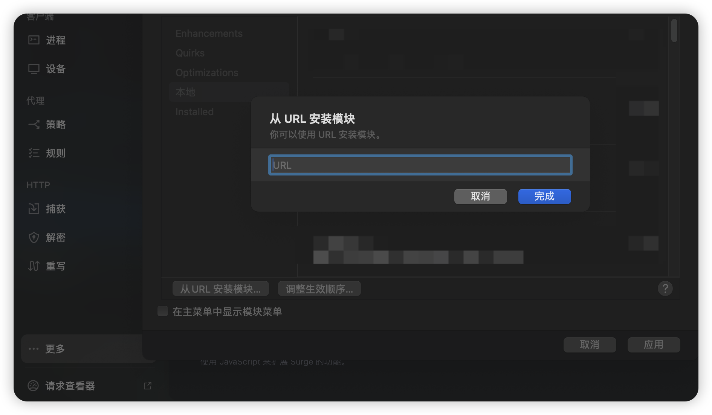

3️⃣.更新外部资源

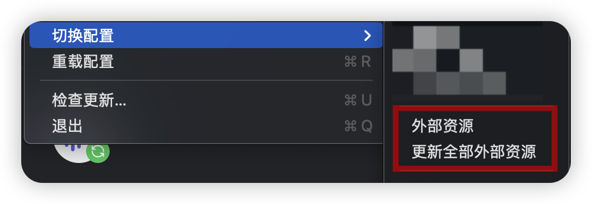

4️⃣.在App中随意输入序列号和邮箱,点击激活后秒激活

</details>

# 目的

本项目是Free的、开源的、基于互联网最原始的共享精神的、不接受任何打赏的、无所不包的、令人感叹的、无与伦比的、精妙绝伦的、化腐朽为神奇的、逆天的、养生的、抽象的、二次元的、OP的。

在2023年，所有人都逐渐觉得打赏、付费才是理所应当的，哪怕是某些人只做了一件从外网搬运到国内的工作，也应该得到鼓励。
我不能说这种行为是完全错误的，只能说有些人恬不知耻见利忘义。哪怕是打赏也应该基于双方意愿的基础上，而不是用“打赏后才能下载”这种理由强奸用户的使用习惯，把用户变成必须付费的蠢驴，并辅以几十元的超低价注册会员费用钝刀割肉式的强奸用户。

当然，这种用户也确实是个蠢货。有这种钱你买正版得了，别跟我说太贵，你出去跟朋友吃一顿好点的饭200起步，大部分好软件正版才不到100块钱。抽包烟软中煊赫门起步，面对19.9年费会员时却面露难色，好像杀了你的🐎一样。相信我，你也并不是真的需要这些软件，只是人云亦云盲目从众罢了。

我认为，共享精神不应该建立在物质上，我深刻的理解金钱对人的吸引和动力，但这种精神本身就超越了物质。

# 骂人小作文

下方小作文阅前预警:

- 大家都知道楼主一向是有话直说 比较单纯
    - 喷人解决不了问题 但是能解决一部分人潜在会提出的问题
    - 但是请大家放心，楼主素质是很高的 爱恨分明。
    - 玻璃心的人现在立刻关闭当前网页，继续阅读我怕你被我喷的到处散布谣言说我坏话败我路人缘。
    - 有些人不专门写小作文喷一下真的就是为所欲为，本来不想搭理但是有的人真的该喷。

本群欢迎以下人群进入:

- 愿意学习交流安全共享知识技术的人 不区分大佬和新手 一律欢迎
    - 不抄ChatGPT答案的人
        - 他妈的ChatGPT给的答案都是0x1000为例子 有的人猪脑子直接复制答案 完全看不到gpt说了是“例如” 还他妈把0xFFFC这种答案复制粘贴
          你这种人确实没脑子 别进了
        - 真想进就认真答题 错了也会放 我最鄙视的就是没脑子抄答案的人

本群禁止以下人群进入:

- 因为“7.11”停更事件被动引流而来的围观群众
    - 进来只为发一句“慕名而来”的人
    - 加群原因写一句“不知道”/“从xxx地方看到的”/“进来看18岁妹妹后续”这种傻逼

符合以上条件的人先掂量一下你的🐎有几个。<br>
有些傻逼进来就为发一句“慕名而来”或者发一张截图，配文“从xxx地方看到的”，极其影响老子心情。<br>
本来18岁妹妹g了老子心情就很不好，反复在老子眼前刷要不是老子素质高早他妈喷你了，你是个什么东西要你在这“慕名而来”？<br>
你给老子上眼药老子还不能喷你的？在我看不见的地方刷刷算了，别tm来老子群里刷。<br>

之前还看到有人说老子利用这件事给这个群引流的那些傻逼你听好：<br>

* 首先为接下来的话我给你先道个歉。<br>
    *
  我引你妈了个b流呢？老子跟18岁妹妹郎才女貌要你在这围观评价？你是个什么臭鱼烂虾？引流？老子谈恋爱跟你有几把关系？傻逼。<br>
    *

祝福我的人我虚心感谢，嘲笑我的人先照镜子看看自己单身二十多年天天躲房间里看日本黄片到处求二次元h漫N刷天天做梦自己能碰到女神小姐姐主动倒贴实际上除了同学朋友也很少月薪三千最后没办法找个190kg坦克还要忍受小仙女作妖27、8岁除了会躲房间里打胶其他什么都不会一事无成的失败人生，你这种废物也好意思评价我？我要是你早他妈从长江大桥上跳下去remake别在这浪费父母资源当个真孝子。

* 你没有脑子不要觉得所有人都没脑子，群里全是(大部分，小部分确实不行)
  安全行业的兴趣爱好者或者安全行业的专家,我需要一窍不通的围观群众拉低我群含金量？<br>
    * 我不需要没脑子的人加进群，ok？这种劣质流量等于垃圾，在我眼里这种人一点价值都没有，除了挨喷没有任何作用。
    * 最后声明: 我热烈欢迎安全爱好者一起学习研究，但是没脑子的围观党禁止加群。这种人你非要加群可以，我没事就喷你。看是你的赛博🐎多还是我的键盘厉害。

# ~~免责声明~~wo ze ni ma de b

致来自中国大陆的各位学习研究爱好者:<br>
根据大陆中华人民共和国《计算机软件保护条例》第十七条规定：“为了学习和研究软件内含的设计思想和原理，通过安装、显示、传输或者存储软件等方式使用软件的，可以不经软件著作权人许可，不向其支付报酬。”您需知晓本仓库所有内容资源均来源于网络，仅供用户交流学习与研究使用，版权归属原版权方所有，版权争议与本仓库本作者无关，用户本人下载后不能用作商业或非法用途，需在24小时之内删除，否则后果均由用户承担责任。
如果你不删那就让这些喜欢发律师函的事务所一对一指导你。

我是來自北美的獨立IOS應用程式開發者,專注於開發有趣又富有創意的應用。對於法律問題,我只能說明技術原理,不能提供任何法律意見。希望大家都能以和平、理性的態度來探討各種課題。

同時, 我也是二次元南桐. 从台灣國立大學毕业的那一天, 我的青春永遠留在了高雄.

對於肆意濫用法律的組織和個人,請將律師和發送至: 华盛顿特区第35大道林肯大街15号-501, John Albet收.

# ~~停更~~

~~最近想追个19岁的小妹妹。<br>
项目基本上不会更新了，增加的新项目基本上是工作💻需要才做的。<br>
也不会去维护下面App的新版本了，等我追到手🧑‍🤝‍🧑再说罢！<br>~~

~~为了追💗妹妹👧，MD，跟米哈游原神铁道星穹崩坏王者荣耀蛋仔二次元拼了😡👊！<br>
这下不得不成为农P/原P/穹P了🙏🙏<br>~~

~~无知时诋毁原神🫤🙏<br>
成熟时理解原神😭🙏<br>
恋爱时成为原神😋🙏<br>~~

~~原神助我！喝唉！🖐大荒天陨！️<br>
任何邪恶！终将绳之以法👮！<br>~~

~~原神，启动！~~

失败了，大家别问了。 <br>
她不是不喜欢玩游戏，她只是不想和不喜欢的人玩游戏。<br/>

这段Repo不会删，警钟长鸣。但是你要问我如果再给我一次机会还会不会选18岁妹妹，我的回答是“yes i do.”

